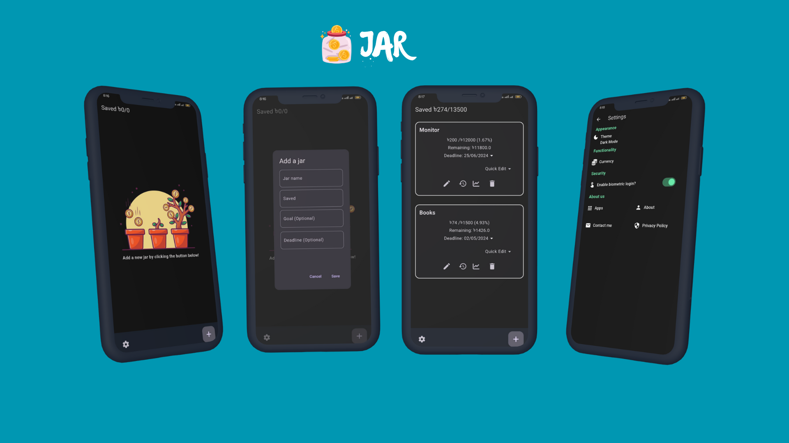

<h1 align="center" style="font-size:28px; line-height:1"><b>Jar - Your Savings Tracker</b></h1>

<a href="https://akashmahmud.eu.org">
  

    
  

</a>

 

 

<a href="https://akashmahmud.eu.org">
  

    
  

</a>

 

---

The jar is a full-fledged, feature-rich application designed to empower users to manage their finances effectively. Built using Flutter - with Hive. This app offers a seamless and intuitive user experience across various devices. Development started in 2024.

------

## Features
* **Create Savings Jars:** Set up dedicated jars for different goals, be it a dream vacation, a rainy day fund, or anything else you're saving for.
* **Biometric Lock:** Ensure the security of your savings with fingerprint or face recognition authentication (depending on your device's capabilities).
* **Multiple Currency Support:** Track your savings in various currencies. JAR flexibly adapts to your needs.
* **Light, Dark, and System Mode Themes:** Choose the theme that best suits your preferences and optimizes viewing comfort.
* **Transaction History:** View a comprehensive record of all your deposits and withdrawals for each savings jar.
* **Visualization:** Gain valuable insights with clear graphs that illustrate your saving patterns and progress over time.

## Download

| Source                                                                       | Status                                                                                                                                                                                                                                                     |
|------------------------------------------------------------------------------|------------------------------------------------------------------------------------------------------------------------------------------------------------------------------------------------------------------------------------------------------------|
| [Github Releases](https://github.com/Viperz75/Jar/releases)          |                                          |
| [F-Droid (IzzyOnDroid)](https://apt.izzysoft.de/packages/eu.darken.sdmse/)   | 

## Screenshots

## License

Jar's code is available under a GPL v3 license, this excludes:

* Jar icons, logos, mascots, marketing materials, and assets.
* Jar animations and videos.
* Jar documentation.
